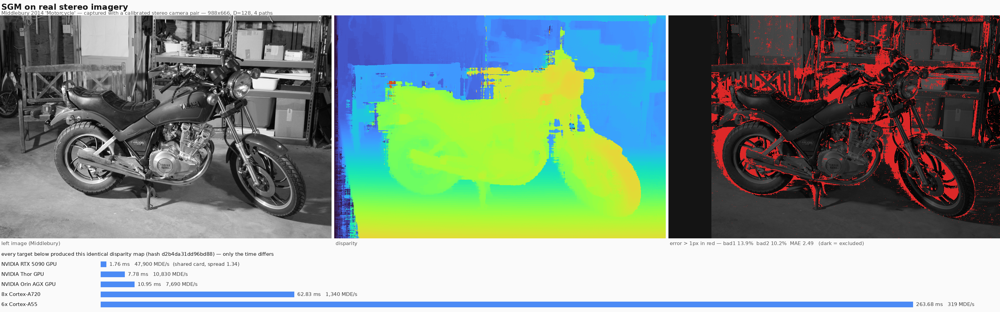
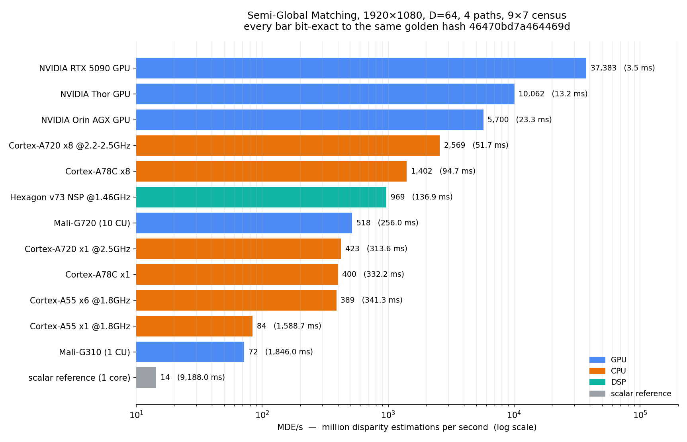
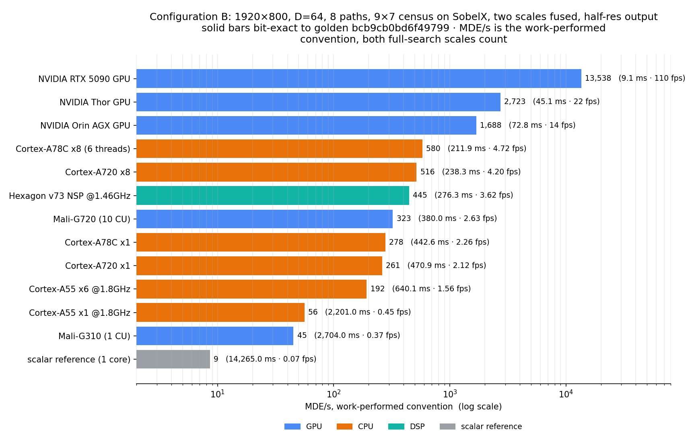
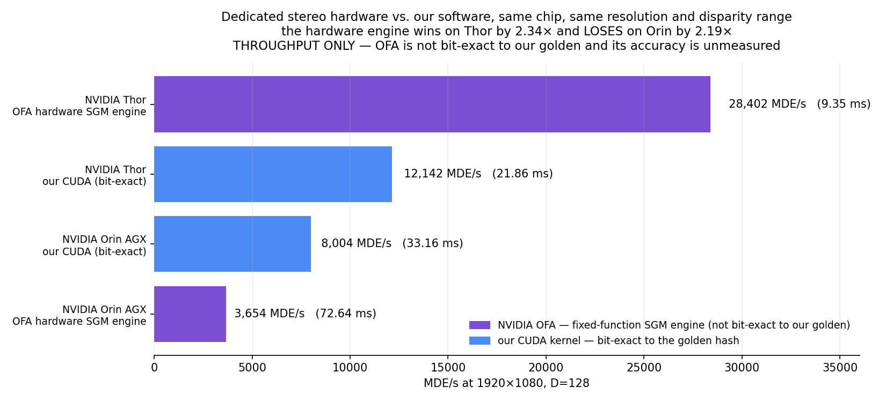

# sgm-bench

**Semi-Global Matching stereo, measured across eleven processing units from
four silicon vendors — five GPUs, three CPU classes, a DSP and two
fixed-function stereo engines — in two configurations, with every target
required to produce byte-identical output — plus a third configuration that
isolates the algorithm and resolution variables one at a time.**

*A real calibrated stereo capture (Middlebury 2014 "Motorcycle"), the dense
disparity map this benchmark computes from it, and the error against structured-
light ground truth — with every processor's time for the identical, byte-exact
result. That is the whole repo in one picture: same answer everywhere, only the
time differs.*

---

## Why SGM is hard

Stereo matching is easy to state and awkward to make fast. For every pixel you
score **D** candidate disparities, then smooth those scores so the depth map is
coherent rather than speckled. The smoothing is what makes it good, and it is
also what makes it hard:

    L(p, d) = C(p, d) + min( L(p−1, d),  L(p−1, d±1) + P1,  min_k L(p−1, k) + P2 ) − min_k L(p−1, k)

**Every pixel depends on the pixel before it.** That is a serial recurrence along
each of four sweep directions, so the obvious parallelism — one thread per pixel —
is unavailable. What is left is parallelism across disparities and across
independent scanlines, and a cross-lane `min` over all D at *every step*.

Three properties fall out, and they shape every implementation here:

- **The work is large and fixed.** 1920×1080 × 64 disparities × 4 paths ≈ 530M
  updates per frame. There is no early exit and no data-dependent shortcut.
- **The intermediate is bigger than the image.** The aggregated cost volume is
  265 MB per frame at 1080p — 128× the input — so a tuned implementation ends up
  **memory-bound**, not compute-bound. Ours reaches 145 GB/s of a measured
  249 GB/s ceiling on Thor.
- **Wide hardware does not automatically win.** A vector unit can fill lanes but
  cannot remove the dependency; hiding it takes independent chains and costs
  registers. That is why the ordering below is not the ordering of raw FLOPS.

Every bar is bit-exact to the same golden hash. The scalar reference at the
bottom is the floor the whole exercise is measured against — the fastest bar is
**~2,600× faster than it, computing byte-identical output**.

---

## Results — Configuration A

The primary configuration: **1920×1080, D=64, 4 paths, 9×7 census**, dense
full-resolution output. MEASURED; full provenance in `REPORT.md`. (A second,
embedded-flavoured configuration is measured on the same roster —
[Configuration B](#configuration-b-multi-scale-8-path) below.)

| target | class | threads | ms | **MDE/s** | DRAM GB/s ‡ | per-core |
|---|---|---|---|---|---|---|
| **NVIDIA RTX 5090 GPU** (Blackwell, 170 SM, CUDA) | GPU | — | 3.46 | **38,356** | 587 / 1,385 | — |
| *NVIDIA OFA on Thor* † | fixed-fn | — | *9.4 (D=128)* | *28,402* | — | — |
| **NVIDIA Thor GPU** (Blackwell, 20 SM, CUDA) | GPU | — | 13.2 | **10,062** | 145 / 249 | — |
| **NVIDIA Orin AGX GPU** (Ampere, 16 SM, CUDA) | GPU | — | 23.3 | **5,700** | 87 / 175 | — |
| 8× Cortex-A720 @2.2–2.5 GHz (Radxa O6) | CPU | 8 | 51.7 | **2,569** | 6.6 / 46.3 | 423 |
| *NVIDIA OFA on Orin AGX* † | fixed-fn | — | *72.6 (D=128)* | *3,654* | — | — |
| 8× Cortex-A78C (IQ-9075) | CPU | 6 | 98.0 | 1,354 | 3.4 / — | 395 |
| **Hexagon v73 NSP** @1.46 GHz | DSP | 4 | 148.4 | **894** | 6.8 / 28 | — |
| Mali-G720, 10 CU | GPU | — | 256.0 | 518 | 16.1 / 46.3 | — |
| 1× Cortex-A720 @2.5 GHz | CPU | 1 | 313.6 | 423 | 1.1 / 46.3 | 423 |
| 1× Cortex-A78C | CPU | 1 | 336.1 | 395 | 1.0 / — | 395 |
| 6× Cortex-A55 @1.8 GHz (i.MX 95) | CPU | 6 | 341.3 | 389 | 1.1 / 13.7 | 84 |
| 1× Cortex-A55 @1.8 GHz | CPU | 1 | 1588.7 | 84 | 0.2 / 13.7 | 84 |
| Mali-G310, 1 CU | GPU | — | 1846.0 | 72 | 1.6 / 13.7 | — |
| scalar reference, 1× A55 | floor | 1 | 9188.0 | 14.4 | — | — |
| *NVIDIA OFA on RTX 5090* † | fixed-fn | — | *stereo mode removed* | — | — | — |

‡ **achieved / ceiling, in GB/s — this workload is about moving data.** At 1080p
D=64 the aggregation phase alone streams **1.46 GB per frame** (the summed cost
volume is 265 MB, touched four times). The *ceiling* is MEASURED on each part
with a streaming-copy probe (`tools/gpu_bandwidth.cu`); the *achieved* figure is
DERIVED — the kernel's exact modelled byte count divided by the measured phase
time — not read from DRAM counters. The Hexagon pair is the qualcomm session's
own probe and model; CPU/Mali ceilings come from `tools/cpu_bandwidth.c` run on
each board (13.7 GB/s on the i.MX 95, 46.3 on the O6 — CPU and Mali share one
LPDDR bus, so one probe serves both rows). The A78C ceiling is unmeasured (that
board is another session's) and its cell says so rather than guessing.

The column tells one story twice. The NVIDIA GPUs sit at **42–58% of their
ceiling** — memory-bound, which is why their optimisation ended at traffic
reduction. The CPUs and Malis sit at **8–37%** — *not* bandwidth-bound, which is
why their wins came from arithmetic instead: vectorised argmin, blocking, lane
tricks. Same algorithm, opposite walls, visible in one column.

† Dedicated stereo engines measured beside the GPUs they share a die with —
**throughput only, not bit-exact to the golden** (VPI's SGM is NVIDIA's own
implementation). On Blackwell the stereo mode returns `UNSUPPORTED_FEATURE`;
details under *Dedicated stereo hardware* below.

Thor's peak across the D sweep is **12,138 MDE/s at D=128**; it falls back to
9,409 at D=256, where S traffic (1.06 GB) overtakes the amortisation gain. **The
5090 shows no such reversal** — 38,356 / 60,932 / 76,248 MDE/s at D=64/128/256 —
which is what the mechanism predicts on a part with 5.6× the bandwidth.

### Resolution and disparity

At D=64 efficiency falls
**10,077 → 9,467 → 9,267 → 9,187 MDE/s** from 1080p to VGA — a **1.10×** fall,
not the 1.97× the under-sampled grid showed. Larger D remains clearly cheaper per
disparity: **6,266 → 10,077 → 12,260** at 1080p as D goes 32 → 64 → 128.

### Is it just bandwidth?

Since the kernel is memory-bound, the honest cross-GPU question is whether
throughput is simply a proxy for DRAM bandwidth. Ceilings measured with a
streaming-copy probe on each part:

| GPU | aggregate | achieved | ceiling | utilisation | MDE/s |
|---|---|---|---|---|---|
| RTX 5090 | 2.49 ms | 587 GB/s | 1,385 GB/s | 42% | 38,356 |
| Thor | 10.04 ms | 145 GB/s | 249 GB/s | 58% | 10,062 |
| Orin AGX | 16.83 ms | 87 GB/s | 175 GB/s | 49% | 5,701 |

**Largely yes, and the residual is the interesting part.** All three land in a
narrow 42–58% utilisation band, and MDE/s per GB/s of ceiling is 27 / 40 / 33 —
within 1.5× across a 7.9× spread in bandwidth. The 5090 is the *least* efficient
of the three despite being fastest, which says it is no longer purely
bandwidth-bound at that speed.

**MDE/s** = million disparity estimations/sec = `W × H × D / runtime`. It is the
unit the literature uses because fps hides D — two implementations can both
report "30 fps" while doing 100× different work. It normalises D but **not**
census window size or path count, so compare those explicitly.

The most interesting row is the DSP, and not for the reason first published
here. SGM's aggregation is a serial recurrence in x or y, so the obvious reading
is that a wide unit can fill lanes but cannot hide the dependency. On that
reading the Hexagon NSP first measured **18.7× slower** than the CPU cluster.

It is now **1.51× on medians** (the board is bimodal between invocations, so
minima flatter it), and it beats a *single* A78C core by **2.26×** — a ~12× move
in one day, bit-exact throughout. **The latency is hideable**, by interleaving
independent dependency chains at a cost in registers; the part that was
latency-bound was never bandwidth-bound (28.17 GB/s available, 6.8 consumed).

⚠️ Which means the Mali figure here is probably a floor too, by the same
mechanism: `mali_cl/sgm.cl` carries **one** dependency chain per work-item with
three barrier sites per step and never interleaves. 518 MDE/s is what this
kernel does, not what the G720 can do.

Read that as *weaker* than it sounds, not stronger. The mechanism predicts the
number is low; it does not predict **by how much**. 518 is now an **unbounded
floor** rather than a measurement of the hardware, and "the GPU could be much
faster" is not the same claim as "the GPU is competitive". Nobody has done for
the Mali what was done for the DSP, so nobody knows. `REPORT.md` has the full
trajectory, including a DERIVED ceiling that was wrong by 4×.

---

## Configuration B: multi-scale, 8-path

The same roster as Configuration A, on a second configuration (`multiscale/`) —
deliberately harder and more
embedded-flavoured than the primary one: **1920×800 in → 960×400 out**, a full
64-disparity SGM at *both* half and full resolution with the two **data costs
averaged** before aggregation (multi-scale cost fusion — both scales do full
work, this is not a coarse-to-fine search), census 9×7 on a **SobelX-prefiltered**
image, **eight paths** with direction-weighted P1 (40 h / 20 v / 10 diag),
P2=200 saturating, half-resolution output. Same acceptance model: its own scalar
oracle defines a golden, and every implementation must reproduce it byte-exactly.

| target | ms | fps | MDE/s (work) † |
|---|---|---|---|
| *NVIDIA OFA on Thor* ‡ | *3.38* | *296* | *—* |
| **NVIDIA RTX 5090** (CUDA) | 9.08 | **110.2** | 13,538 |
| *NVIDIA OFA on Orin AGX* ‡ | *14.90* | *67.1* | *—* |
| **NVIDIA Thor** (CUDA) | 45.1 | 22.2 | 2,723 |
| **NVIDIA Orin AGX** (CUDA) | 72.8 | 13.7 | 1,688 |
| 8× Cortex-A78C (NEON, 6 threads) | 211.9 | 4.72 | 580 |
| 8× Cortex-A720 (NEON) | 238.3 | 4.20 | 516 |
| **Hexagon v73 NSP** (HVX, 4 threads) | 276.3 | 3.62 | 445 |
| **Mali-G720**, 10 CU (OpenCL) | 380.0 | 2.63 | 323 |
| 1× Cortex-A78C (NEON) | 442.6 | 2.26 | 278 |
| 1× Cortex-A720 (NEON) | 470.9 | 2.12 | 261 |
| 6× Cortex-A55 (NEON) | 640.1 | 1.56 | 192 |
| 1× Cortex-A55 (NEON) | 2,201 | 0.45 | 56 |
| Mali-G310, 1 CU (OpenCL) | 2,704 | 0.37 | 45 |
| scalar reference, 1× A55 | 14,265 | 0.07 | 8.6 |

† work-performed convention: both scales count — (0.384 + 1.536) Mpx × 64 / time.

‡ The OFA engines **cannot run this configuration's algorithm** (no two-scale
cost fusion, no weighted P1, D=128 minimum) — these rows are the engines
running **their own** SGM at matched input *and* output geometry: 1920×800 in,
960×400 out via `downscaleFactor=2`, D=128, medians of 50 after a 30-frame
warm (`nvofa/vpi_stereo_bench.py`). Throughput only, **not bit-exact, not
gated**, and the MDE/s cell is deliberately blank — this configuration's work
convention would be fiction for a different algorithm. Full-resolution-output
variants: Thor 9.15 ms, Orin 54.94 ms.
All software rows bit-exact to golden `bcb9cb0bd6f49799` — the same implementation tiers
as the primary configuration: tuned CUDA on the NVIDIA GPUs, OpenCL on the
Malis, NEON+OpenMP on the Arm cores, and the plain-C oracle as the floor. The
CUDA port lacks the primary kernel's path-pairing pass, so its rows are the
conservative side of what those GPUs can do. The Hexagon row is the tuned HVX port
(median of five invocations, 0.75% spread, independently re-verified); the A78C
rows are the same NEON tier as the other Arm cores (medians of five invocations
on a board measured bimodal at ~9% — medians, not minima).

Worth noting because an earlier reading got it wrong: with the A78C briefly at
the *oracle* tier the NSP appeared to lead the CPU cluster 3.29× on this
configuration — a cross-**tier** comparison wearing a platform comparison's
clothes. At matched tiers Configuration B looks like Configuration A: the
six-thread cluster leads one NSP ~1.3× on both. Per *engine* the NSP holds its
win — one NSP beats one A78C core 1.60× here (442.6 / 276.3).

## Configuration C: one variable at a time

Configurations A and B differ in *two* ways at once — the algorithm (paths,
scales, prefilter) **and** the input resolution — so their fps cannot be
compared without compounding explanations. Configuration C separates them: it
is **exactly Configuration B's algorithm run on Configuration A's own
1920×1080 stereo pair** (output 960×540). A→C isolates the algorithm at fixed
input; C→B isolates resolution at fixed algorithm. Golden `0f0961d623009df5`,
generated by the same oracle from `data/synthetic/`.

| target | ms | fps | MDE/s (work) † |
|---|---|---|---|
| *NVIDIA OFA on Thor* ‡ | *4.08* | *245* | *—* |
| **NVIDIA RTX 5090** (CUDA) | 11.96 | **83.6** | 13,870 |
| *NVIDIA OFA on Orin AGX* ‡ | *19.51* | *51.2* | *—* |
| **NVIDIA Thor** (CUDA) | 56.7 | 17.7 | 2,928 |
| **NVIDIA Orin AGX** (CUDA) | 96.9 | 10.3 | 1,711 |
| 8× Cortex-A720 (NEON) | 239.6 | 4.17 | 692 |
| 8× Cortex-A78C (NEON, 6 threads) | 291.8 | 3.43 | 569 |
| **Hexagon v73 NSP** (HVX, 4 threads) | 372.4 | 2.69 | 446 |
| **Mali-G720**, 10 CU (OpenCL) | 509.4 | 1.96 | 326 |
| 1× Cortex-A78C (NEON) | 595.3 | 1.68 | 279 |
| 1× Cortex-A720 (NEON) | 643.1 | 1.55 | 258 |
| 6× Cortex-A55 (NEON) | 844.8 | 1.18 | 196 |
| 1× Cortex-A55 (NEON) | 2,954 | 0.34 | 56 |
| Mali-G310, 1 CU (OpenCL) | 3,657 | 0.27 | 45 |
| scalar reference, 1× A55 | 18,020 | 0.07 | 9.2 |

† Work convention: (2.074 + 0.518) Mpx × 64 / time — 35% more searched pixels
than B. Every software row is bit-exact to the golden; the A78C and Hexagon
cells are medians of repeated invocations on that bimodal board (the NSP: five
invocations, 1.7% spread, run with the unmodified Configuration B kernels).

Row for row, the C/B wall-clock ratios cluster tightly around the **1.35×** the
pixel count predicts: 5090 1.32, Thor 1.26, Orin 1.33, NSP 1.348, both Malis
1.34–1.35, every single core 1.32–1.37, the OFA engines 1.21/1.31 — with a
single exception, the eight-thread A720 cluster at **1.01×**, taken up below.

‡ Same convention as the Configuration B OFA rows: the fixed-function engines
running **their own** SGM at matched geometry (1920×1080 in, 960×540 out via
`downscaleFactor=2`, D=128) — throughput only, not bit-exact, MDE/s
deliberately blank. Full-resolution-output variants: Thor 9.95 ms, Orin
73.77 ms — the Thor 9.95 reproduces the Configuration A OFA row's shape within
6% on an unpinned-clock session, which is the instrument's cross-check.

**Read as two clean statements.** On the 5090: A→C, same input images, is
3.46 → 11.96 ms — *the eight-path two-scale algorithm costs ~3.5× the four-path
single-scale one*. C→B, same algorithm, is 11.96 → 9.08 ms — *shrinking
1080→800 rows buys back exactly its pixel share (1.32× vs the 1.35×
prediction)*. Nothing left to hand-wave.

⭐ **And one genuine finding fell out**: the A720 *cluster* runs C at B's
wall-clock (239.6 vs 238.3 ms, ratio 1.01×) while its *single core* scales
perfectly with pixels (1.37×). B's eight-thread run was never work-limited —
its thread scaling was 1.98× against C's 2.68× — so the extra 35% of pixels
ride in the cluster's slack for free. Every other target pays the pixel tax;
the one that doesn't is telling you where its ceiling *isn't*. The NSP is the
cleanest counter-example: C/B = 1.348 against the 1.35× prediction and
essentially identical MDE/s on both scenes (444.8 vs 445.5) — a work-limited
engine holding constant efficiency across the resolution change, exactly where
the A720 cluster was not.

## On real stereo imagery

Seven of the targets are also verified on a **real calibrated stereo capture** —
Middlebury 2014 "Motorcycle", 1482×1000, D=128 — producing the identical golden
`e8a95242882013f0`:

| target | ms | MDE/s |
|---|---|---|
| NVIDIA RTX 5090 | 3.32 | 57,137 |
| NVIDIA Thor | 15.94 | 11,901 |
| NVIDIA Orin AGX | 23.91 | 7,934 |
| 8× Cortex-A720 | 112.44 | 1,687 |
| Mali-G720 (10 CU) | 296.17 | 640 |
| 6× Cortex-A55 | 590.50 | 321 |
| Mali-G310 (1 CU) | 2340.17 | 81 |

Accuracy against dense ground truth: **bad>1px 16.2%, bad>2px 11.2%, MAE 3.35**,
scoring the leftmost D columns as excluded because `x−d < 0` has no
correspondent. An earlier revision of this scene was **independently scored by another party's
implementation on hardware we have never touched** — against the ground truth
rather than against our map — agreeing to 0.05 points on all three metrics. The
current scene's figures are ours alone so far.

⭐ The real scene is the **accuracy** reference and pins the hash-critical
tie-break rule **720× harder** than synthetic (14,417 tied-minimum pixels
against 20). The **synthetic** goldens carry the top-of-range correctness role —
the real scene's true disparities stop at 119.8, so it cannot test truncation
near d=127 and is not used as a gate there.

## Measurement quality

Every figure here is a median with its spread stated. Dedicated boards measure
at **p95/median 1.00–1.04**; the RTX 5090, the only shared machine, runs
**1.11–1.29** because its clocks are unlocked and a remote-desktop process
co-resides on the card. Longer warm-ups do not help; between-run medians are
reproducible to 2–7%, so its numbers are sound but carry real uncertainty.

Phase timings exclude host↔device transfer, and the reported thread count is the
team size observed inside the parallel region rather than the value requested.
`REPORT.md` has the full dispersion table.

## Quick start

Needs gcc with OpenMP and NEON. On the target board:

    make MCPU=cortex-a55 golden   # build reference, synthesise a stereo pair, make the golden map
    make MCPU=cortex-a55          # build the implementations
    make MCPU=cortex-a55 check    # every impl vs golden; exits 2 on any mismatch

Then benchmark, pinned:

    ./scripts/pin.sh              # run directly: prints CPU topology by MIDR part

    source scripts/pin.sh        # then SOURCE it — pin_run is a shell function
    pin_run a55 6 ./bin/sgm_a55 \
        data/synthetic/left.pgm data/synthetic/right.pgm \
        -g data/golden/synthetic.pgm -t 6 -j results/run.json --board imx95

`pin_run <uarch> <nthreads> <cmd...>` sets `OMP_NUM_THREADS`, `OMP_PLACES=cores`,
`OMP_PROC_BIND=close` and a `taskset` mask, forces the performance governor, and
logs per-core frequency before and after the run so you can see throttling.

It selects cores by **MIDR part number, not CPU index** (`pin_list a720` →
`4,5,6,7`), because CPU numbering is not stable across boards and "the big
cluster" is not a portable concept. Use it rather than invoking the binary bare:
on a heterogeneous SoC the scheduler will otherwise migrate threads onto the
wrong cluster mid-measurement.

Configuration B builds as standalone binaries:

    gcc -O3 -mcpu=native -fopenmp -Icommon -o sgm_ms \
        multiscale/sgm_ms_neon.c common/census_neon.c common/util.c -lm
    ./sgm_ms data/multiscale/left.pgm data/multiscale/right.pgm \
        -g data/multiscale/golden_ms.pgm -t $(nproc)

Harness flags: `-o out.pgm`, `-g golden.pgm`, `-t threads`, `-w warmup`,
`-n timed`, `-j results.json`, `--board name`. Timing is the median of `-n`
runs; p95 and min are also recorded.

---

## Dedicated stereo hardware

Both Jetsons carry an **OFA — Optical Flow Accelerator** — whose VPI header
documents a *"semi-global matching (SGM) computation"* with optional diagonal
paths. It is a fixed-function stereo engine, exposed as
`VPI_BACKEND_OFA`, and it only accepts `maxDisparity` of **128 or 256**.

| board | our CUDA (bit-exact) | OFA hardware engine | |
|---|---|---|---|
| **Thor** | 21.86 ms · 12,142 MDE/s | **9.35 ms · 28,402 MDE/s** | hardware wins **2.34×** |
| **Orin AGX** | **33.16 ms · 8,005 MDE/s** | 72.64 ms · 3,654 MDE/s | software wins **2.19×** |

⭐ **The dedicated engine wins on one part and loses on the other.** Thor's OFA
is 7.8× faster than Orin's at the same settings — a generational jump in the
fixed-function block that is far larger than the 1.5× between the two GPUs. On
Orin, a hand-written CUDA kernel beats the silicon built for this exact job.

🔴 **And the throughput comparison says nothing about quality.** An attempt to
score both against ground truth validated our own implementation (2.6% bad
pixels, MAE 0.45 over the searchable range) but could not resolve OFA's output
convention — it does not align under any simple descaling. **OFA's accuracy is
unmeasured.** `REPORT.md` has the full adversarial review, including a first
attempt at that measurement which scored our own bit-exact code at 40% bad by
including pixels no D=128 search can reach.

⚠️ **These rows are NOT bit-exact to our golden and are not gated by it.** VPI's
SGM is a different implementation — its own census, penalties, and confidence
output — so this is a throughput comparison at matched resolution and disparity
range, not the same test the rest of this repo runs. It is kept in a separate
figure for that reason.

⭐ **On the discrete 5090 the stereo mode is already gone.**
`NV_OF_MODE_STEREODISPARITY` returns `UNSUPPORTED_FEATURE` at every grid size;
NVIDIA's documented deprecation has already landed on Blackwell. Its fallback —
read the X component of general optical flow — measures **8.50 ms with 5.3% bad
pixels**, against our CUDA SGM's **4.13 ms and 2.8%** on the same scene. The
software is faster *and* more accurate there, while doing less work (1D vs 2D
search). And the fallback's cost is concrete: **13.4% of pixels come back with a
non-zero vertical component, the largest 75 pixels** — errors the removed stereo
mode was structurally incapable of producing.

⚠️ **Watch the downscale factor.** OFA defaults to `downscaleFactor=2`, which
emits a **960×540** disparity map from a 1920×1080 input and runs in 4.14 ms on
Thor. Quoting that as a 1080p result would overstate it by 2.3×. Every number
above is `downscaleFactor=1`, full-resolution output. This is the same
convention trap that makes many vendor throughput figures unusable: always check
whether the quoted rate is for the input resolution or the delivered output.

## The workload

All parameters live in exactly one place, [`common/sgm_params.h`](common/sgm_params.h),
which no implementation may bypass. Defaults:

| | |
|---|---|
| disparity range `SGM_D` | 64 (multiple of 16; 128 also tested) |
| paths `SGM_PATHS` | 4 — L, R, U, D |
| census window | 9×7 → **62-bit** descriptor (centre excluded) |
| penalties | `P1=20`, `P2=192` |
| output | uint8 integer disparity; no LR check, no subpixel, no median |

The recurrence, per path:

    L(p,d) = C(p,d) + min( Lp(d), Lp(d±1)+P1, min_k Lp(k)+P2 ) − min_k Lp(k)

with `Lp` the previous pixel along the path, additions **saturating** at 255 and
out-of-range `d±1` treated as 255. The renormalisation subtraction is what keeps
`L` in 8 bits; `sgm_params.h` static-asserts `SGM_COST_MAX + SGM_P2 <= 255`,
which is the constraint that makes a uint8 path cost legal at all.

Ties in the final `argmin` go to the **lowest** d. That is an arbitrary choice,
but it must be the same arbitrary choice everywhere or the hash diverges on
perfectly valid implementations.

⚠️ **Census bit order is a free parameter and the spec pins it anyway.** Hamming
distance is `popcount(a ^ b)`, so any permutation applied consistently to both
descriptors leaves every cost unchanged. The order is fixed (dy outer, dx inner,
centre skipped, edges replicated) purely so independent ports land on the same
hash. If a permutation is cheaper on your ISA, take it — you are free here, and
the freedom is worth more as permission not to worry than as an optimisation.

---

## Layout

    common/          reference impl, harness, params, shared NEON census/hamming
    a55/             the main NEON implementation (also used on A720/A78C)
    a55/baseline/    phase-0 standalone benchmarks, kept unchanged for reference
    a55/sgm_fused.c  REJECTED wavefront experiment, kept for its header
    a720/            A720-specific variant (K-row interleaving; measured no gain)
    colmajor/        column-major layout experiment — contributed, not my work
    hvx/             Hexagon HVX SGM kernels, both configurations, + DSP bandwidth probe — contributed, not my work
    mali_cl/         OpenCL kernel + host
    cuda/            CUDA kernels: the naive port and the tuned warp-centric one
    multiscale/      Configuration B: oracle, NEON, OpenCL and CUDA implementations
    nvofa/           driver for NVIDIA's fixed-function stereo engine (NvOF API)
    tools/           the GPU and CPU streaming-copy bandwidth probes
    scripts/         pinning, sweeps, golden checks, chart/deck generators
    data/golden/     Configuration A goldens + sha256 + roofline calibrations
    data/shared/     the cross-platform D=64/128/256 scene and its goldens
    data/multiscale/ Configuration B scene and golden
    data/real/       Middlebury-derived real-imagery scene and ground truth
    docs/            results chart, panels, and the generated deck
    REPORT.md        the measurement record, with provenance on every number

`colmajor/` and `hvx/` were contributed by a collaborating session working on
Qualcomm silicon and are credited as theirs.

That gap is now closed: `hvx/configA/` and `hvx/configB/` carry the full
contributed HVX kernel sets behind every Hexagon row (kernels, IDL, host
driver, skel build fragment, and build notes in `hvx/README.md`), so the
entire table rebuilds from this repository.

### Adding an implementation

Provide a translation unit exporting one symbol:

    const sgm_impl SGM_IMPL = { "myimpl", my_run };

where `my_run(left, right, W, H, disp, threads, stage_times)` fills `disp`. Then
in the Makefile:

    IMPLS += myimpl
    IMPL_myimpl_SRCS := myimpl/sgm_myimpl.c common/census_neon.c

`make check` picks it up automatically. The Makefile ships with only `a55`
enabled; the others are built by uncommenting their block, and `mali_cl` needs
`-lOpenCL` added by hand. Configuration B implementations are standalone
binaries instead (two images in, half-resolution map out — see
`multiscale/sgm_ms_ref.c` for the contract); gate them with `-g
data/multiscale/golden_ms.pgm`.

---

## What made it fast

Nine optimisations were tried; **four survived measurement and five were
rejected**. The rejects are documented with their mechanisms in `REPORT.md`,
because a benchmark that only reports its wins is describing a different project
than the one that happened.

Kept: vectorised argmin (1.54×, it was 132M scalar iterations per frame);
blocked column sweep (2.4×, fixing a stride-15 KB access pattern);
per-core block-width tuning (~1.25×, and the optimum differs by core — A55 wants
192, A720 wants 256); non-temporal stores plus 64-byte alignment (2.8%).

Three rules the *failures* produced:

1. **A wavefront only buys parallelism when the dependency granule is smaller
   than the parallel unit.** Row-to-row dependency with row-sized work units is
   serial execution with extra atomics. This one was 2.9× *worse* and was only
   caught by measuring it.
2. **Strided writes cost more than stream count saves.** Interleaving two cost
   planes to remove a read stream was 13% worse, with L3 refills up 17% —
   falsifying the hypothesis that stream count was the binding constraint.
3. **The materialised 133 MB plane is not waste**; it is the price of
   parallelising a vertical recurrence, and every attempt to trade it away cost
   more than it saved.

---

## How the numbers are kept honest

Infrastructure rather than findings, in brief. A run given `-g` checks its output
hash against a scalar reference **in the same invocation as the timing** and
exits 2 on mismatch. ⚠️ `-g` is optional: omit it and you get a timing with
`golden_match: -1`, so "no number without a check" describes the gated path, not
the tool. `sweep.sh` aborts on a mismatched cell and `geometry.py` refuses
unverified rows entry to the grid. A second
gate compares each phase against a calibrated cost and exits 3 when a phase is
correct but too slow, because a golden hash cannot see a kernel that is
bit-exact and half-scalar. The threshold was set by planting a real defect and
confirming the gate fires.

Details, and the failure modes that motivated each, are in
[`REPORT.md`](REPORT.md) and `common/roofline.h`.

## Traps

Things that cost real time here, recorded so they cost you less:

- 🚨 **A thread-count flag can be inert and still be reported.** OpenMP takes its
  count from the environment, so a `-t` argument an implementation discards will
  still appear in the results table and the JSON — a row *labelled* single-thread
  holding an all-core timing. Read the count back with `omp_get_num_threads()` from *inside* the parallel
  region — `omp_get_max_threads()` merely echoes the request — and note the direction of the error: it shortens the run that was asked
  to be slow, so it inflates single-thread baselines and flatters whatever they
  are compared against. There is no correction factor, because the magnitude is
  each machine's own thread scaling.
- 🚨 **`sched_getaffinity()` cannot tell you which CPUs a pinned run used.**
  libgomp binds the primary thread in its *constructor*, before `main`, so under
  `OMP_PROC_BIND` that thread reports a single core however early you ask. Take
  the union over the OpenMP team from inside a parallel region instead. The
  obvious call answers a question about the asking thread, not about the work.
- 🚨 **A bit-exact kernel can still be half-scalar, and the hash will never
  tell you.** A census kernel here stepped 128 columns and stopped 124 short of
  the row end, handing 6.7% of pixels to a scalar fallback that ate ~50% of the
  phase. Output was *correct*, so correctness gating said nothing; one
  overlapping tail block took it from 92.0M to 15.8M cycles.

  **This repo ships only one of the two gates a kernel needs.** A golden file is
  a statement about outputs; it can never constrain how they were produced.
  Three things do, in increasing cost:

  1. **Absolute per-phase cost, never shares.** A share moves when any *other*
     phase moves. That census read "6.9% of runtime" and looked finished while
     hiding a 5.8×. The harness already writes absolute `census_ms`,
     `cost_ms`, `aggregate_ms`, `argmin_ms` to the JSON — the data was there
     and nobody gated on it.
  2. **An op-count roofline per phase.** Census is 62 compares over 128 lanes;
     you can compute what it *should* cost within ~2× and compare against that
     rather than against "faster than last time". Anything far off its own
     arithmetic is hiding a scalar path, a spill, or a tail.
  3. **Vector-instruction fraction.** Disassemble the hot function and count
     vector ops. A kernel that is 6.7% scalar *by pixel* is nowhere near 6.7%
     scalar by instruction, because the scalar path is a 62-iteration inner
     loop. The disassembly shows it; the timing does not.
- **gcc 12.2 cannot target `cortex-a720`.** All A720 results use
  `-mcpu=cortex-a710` (same Armv9 family, same 4×128-bit SIMD).
- **Heterogeneous clusters lie about "N cores".** The Radxa O6 has four distinct
  A720 frequency pairs, not two clusters, so a clean homogeneous 4-thread
  per-core measurement is impossible on that part. Always pin.
- **More threads is not monotonic.** The IQ-9075 peaks at 6 threads and is
  *slower* at 8; the O6 scales monotonically to 8. Same program, two machines,
  two answers — sweep, don't assume.
- **"No compute driver" is usually wrong.** Both Mali parts ship working OpenCL
  3.0; the G310 merely lacks `clinfo`, which makes it look driverless.
- **Regenerate the golden after any `sgm_params.h` change.** A stale golden with
  different `paths=` is a textbook false negative and has already happened once.

---

## Ground rules for numbers

Every figure in this repo carries one of three tags, and the distinction is
enforced rather than decorative:

- **MEASURED** — ran on real hardware, with a logged run behind it. Only these
  appear bare or in a comparison.
- **DERIVED** — computed from measurements. Always labelled, and it carries the
  conditions of *both* its factors.
- **SOURCED** — from a paper or datasheet. Always labelled.

**A DERIVED or SOURCED number is never compared against a MEASURED one.** Most
benchmark dishonesty is not fabricated data; it is a projection quietly ranked
in the same column as a measurement.

Every derived column is also a place a number can rot: it can be generated
correctly once and then go stale when its inputs move. Re-derive them
mechanically, or do not publish them. Auditing this repo's own tables that way
found a published figure wrong by 5.8×.

Power is deliberately blank everywhere. No board here exposes a usable rail for
the CPU block alone, and an empty cell beats an estimate.
